<!-- ============ 1. ENCABEZADO ANIMADO (vidrio) ============ -->

 
   

 
<!-- ============ 2. BOTONES DE CONTACTO ============ --> 

 
  
   
  
   

 
<!-- ============ 3. SOBRE MÍ (vidrio) ============ --> 

 
  

<!-- ============ 4. TECH STACK (vidrio) ============ --> 

  

 
<!-- ============ 5. ESTADÍSTICAS ============ --> 

  
  

   

<!-- ============ 6. FRANJA FINAL ============ --> 

 
   

